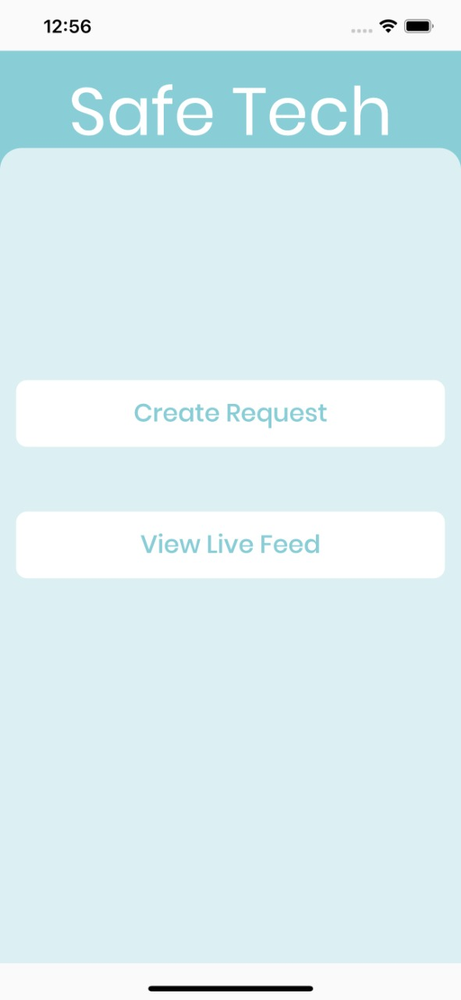
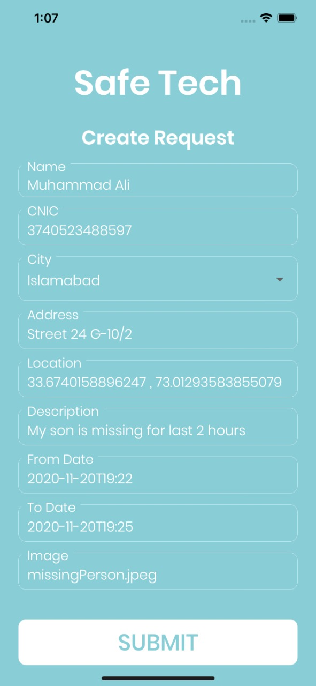
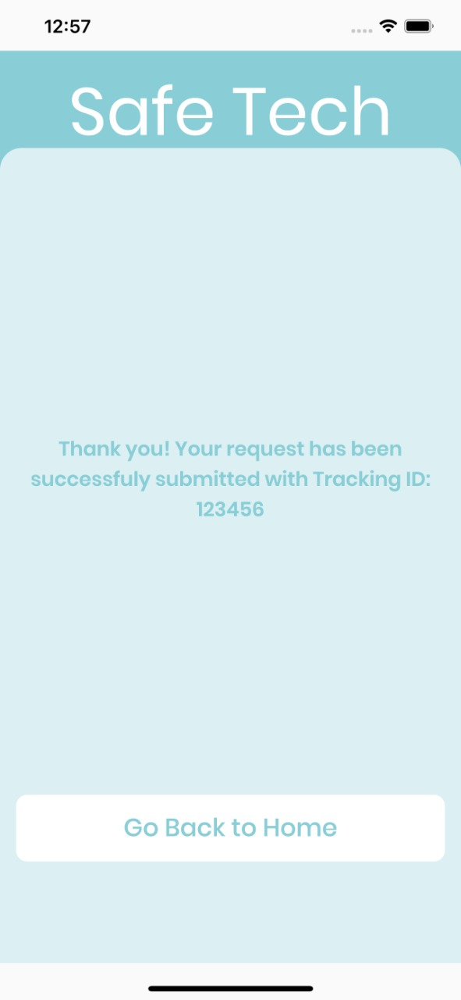
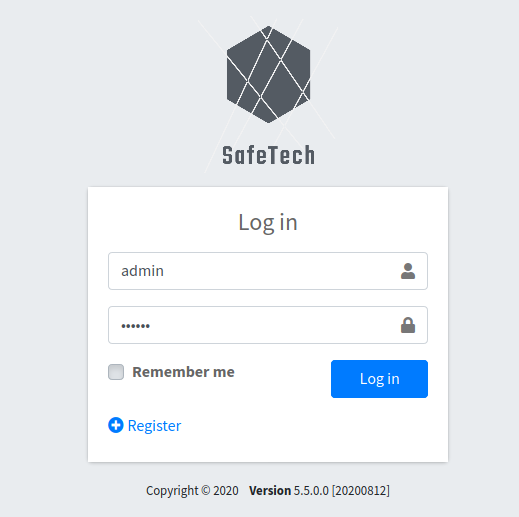
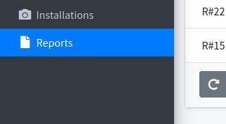
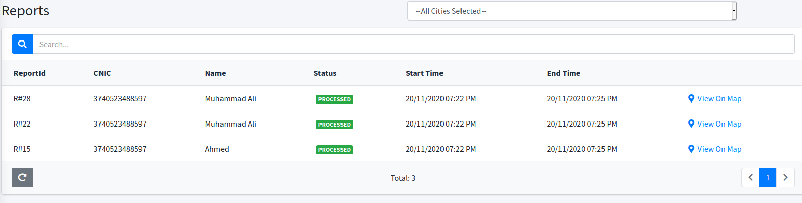
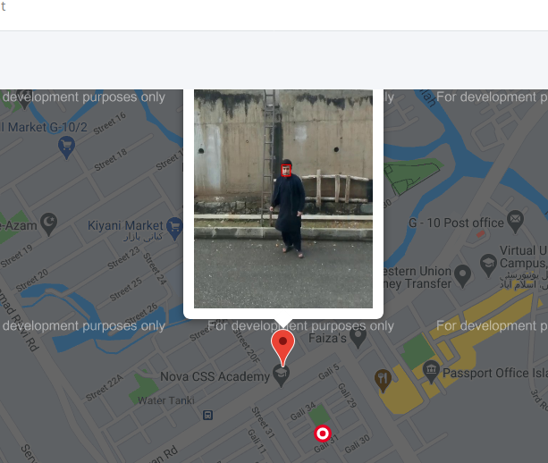
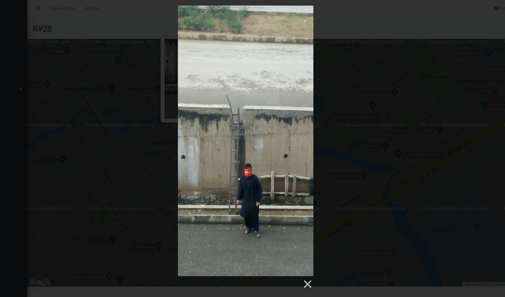

SafeTech
========================

## Problem:

A recent crime report showed that the safety index in Pakistan’s metropolitan cities like Karachi and Lahore is almost 45% i.e. more than half of the residents of these cities do not feel safe. And after that, culprits also escape very easily and police has to work very hard to catch them which also takes much time as well.

## Solution:

In order to overcome this problem, we developed a system named as "Smart Find", which enables every individual to register the case of any mishap using our mobile app. This system works on the public-private partnership for the cameras installed i.e. Cameras installed by Govternment and cameras installed by public. After approval of case from Law Enforcement Officer, an automated smart search is initiated within that area using the cameras installed. After successful search, a report is generated which then assist the law enforcement officer to identify and track the person for which they are looking for. 

Video: https://www.youtube.com/watch?v=iAerWbY7l6Y

### Web Portal (law enforcement officer)

Visit http://3.140.162.29:4200/

### Mobile App

Download the Android/IOS App to submit a complaint 
https://www.dropbox.com/s/0zsxonds6yko03b/app-release.apk?dl=0

### Complaint Registration

1) Click on Login.

2) Click on "Create request" to submit a new complaint.

3) Enter the details of complaint. 
   Example: You can report a missing child and upload his photo (This photo will be used to search him)

4) Now your request is sent. As soon as the request is approved by law eforcement officer, AutoSearch will be started in all cameras.

### Law Enforcement Officer

1) Visit http://3.140.162.29:4200/

2) Click on Login.

3) Now you are in Dashboard. All the requests will be shown here. 
"Pending" will have all the requests waiting for approval (After approval the camera search using AI will start). 

4) For demo purpose you can see old requests that are already processed and report generated. (It can take sometime for processing due to AI Algorithms running) 
   Click on Reports 
   

5) Click on View on Map to see the outcome of the request.  
   

6) The red markings show where the person was detected. (Since the cameras would be in whole Pakistan we can use map so we can see exact trace) 
   

7) Click on red markings and the CCTV images of detected person will show from that area 
   Click on picture to see fullscren and press arrow keys to see other pictures 
   
